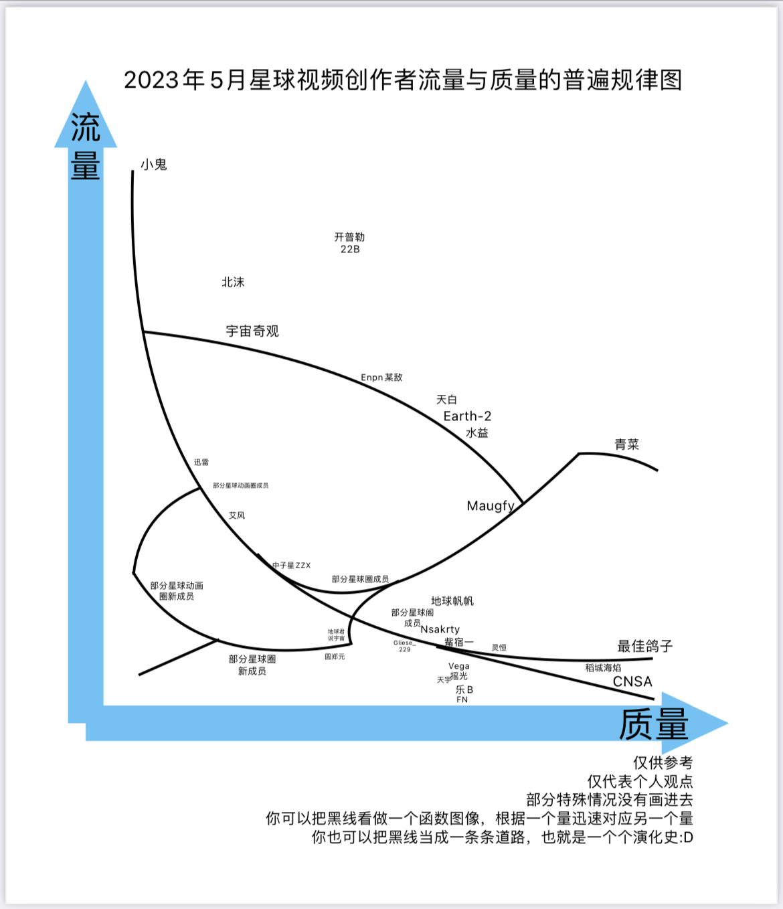

# 论星球圈

## 什么是星球圈?

星球圈，目前多指曾以抖音组织 [星球阁](http://srpn.top) 主张、阁外为辅的星球视频创作者集体(2023年以前)，后以快手星球动画占据主导地位的圈子。此圈确切的形成时间在2021年12月~2022年2月期间，这段时间内，星球阁的热度上涨迅速，同时也出现了许多没有进入星球阁的星球视频创作者以及许多类似于星球阁的组织。在这之前，国内专门制作此类视频的组织只有星球阁。关于这段时间的历史，请自行查阅 [星球阁历史](http://srpn.top/srpn/history.html)。

星球圈在不同的平台上有不同的叫法，抖音快手上的星球动画圈、星球圈，和bilibili的天文圈中的星球视频创作者的部分性质极其接近，本质上也属于星球圈。

## 为什么星球圈会变成这样?

之前的星球圈比现在干净得多，总体水平也比现在高。不过2023年1月，星球动画开始爆火，圈子整体水平开始下滑，新成员的视频普遍是扣的网图，并且还出现了“月球产奶记”这一逆天剧情，这可能和新成员的年龄集中在7~9岁、对低俗行为的认识较少，态度不正确有关。虽然 majority of old members 的视频质量还在继续提升，但是因其热度远没有星球动画高，所以对圈子的作用并不大。这导致了圈子出现严重的两极分化。

其次，成员平均年龄的下降也导致了圈子评价的快速下降，7月末以来，快手爆发了“反星球圈事件”，平台内的许多创作者都开始发布吐槽、反对星球圈的视频，而这一切的起因却是一个星球圈成员得罪了狗头圈并向其“宣战”。

## 星球圈中的成员的反应?

无论在抖音、b站还是快手，都有成员公开表示反对，这些成员多为圈子的老成员，当然也不乏有新成员。然而由于新视频类型的爆火和圈内大佬力量的下降，他们宣传的效果并不好，以抖音为例，一位十万个粉丝的大佬发的宣传视频竟然只有一百多赞，然而同期的一些星球动画视频的点赞量已经上到五万。这也是星球圈会突然变成小鬼圈的一个主要原因。

[返回主页](../index.md)