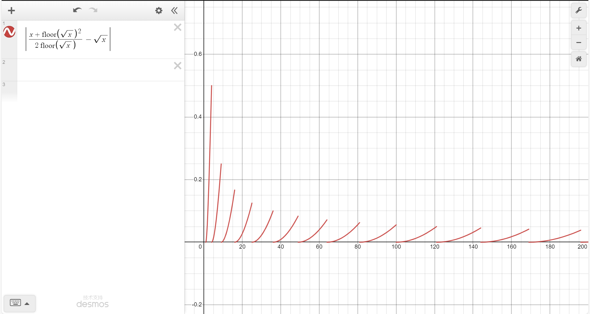
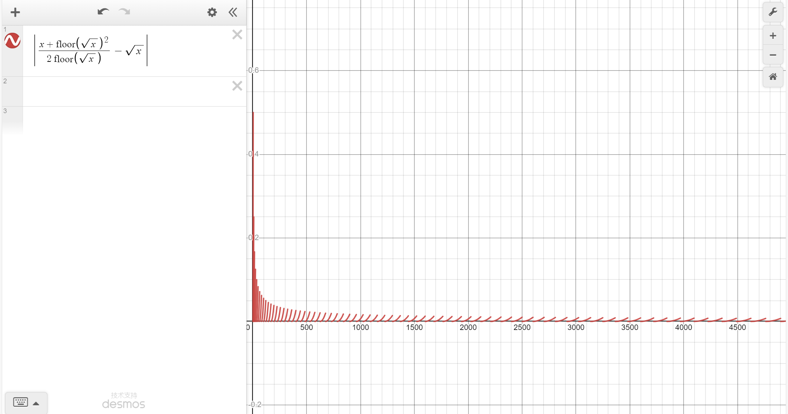

# 算术平方根的快速估算

## 推理过程

$$
\begin{array}{c}
众所周知，对于任意的一个实数x，都有其对应的\sqrt{x}的值\\
设x_0=\left \lfloor \sqrt{x} \right \rfloor，x_1=\sqrt{x}-x_0\\
则有x=(x_0+x_1)^2=x_0^2+2x_0x_1+x_1^2\\
所以x\approx x_0^2+2x_0x_1\\
x_1\approx \frac{x-x_0^2}{2x_0}\\
\sqrt{x}\approx x_0+\frac{x-x_0^2}{2x_0}=\frac{x+x_0^2}{2x_0}
\end{array}
$$

注:

- $\left \lfloor \sqrt{x} \right \rfloor$是这个数的算术平方根的整数部分，很容易推出，
- $\sqrt{x}-x_0$是这个数的算术平方根的小数部分

---

## 与实际值的误差的图像

  

---

## 如何减小误差

由图像可知， $x$ 的值取得越大，误差越小。  
因为一个数的 $100$ 倍的算术平方根等于这个数的算术平方根的 $10$ 倍，所以我们使用此方法减小误差时可以选择把数字乘上  $100$ ，再使用此方法，最后再将结果除以 $10$ ，即可得到更精确的算术平方根，如果想取得更精确的位数，请乘上 $100^x$ ，再把结果除以 $10^x$ 即可，其中 $x$ 是整数。

---

## 三个示例

$\sqrt{2} \approx \frac{2+1^2}{2*1} = 1.5$   

$\sqrt{200} \approx \frac{200+14^2}{2*14} \approx 14.14$

$\sqrt{114514} \approx \frac{114514+338^2}{2*338} \approx 338.3994$  

可以看到非常的好（垃）用（圾）XD

---

# 更多操作

[回到主页](../../index)
